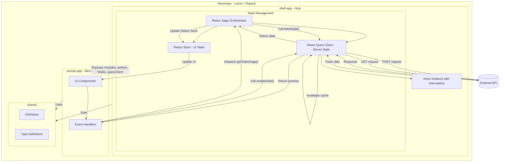

# Monorepo Micro-Frontend Architecture Demo

This project is a demonstration of a modern web frontend application architecture, designed to showcase how various technologies can be integrated to build a scalable, maintainable, and decoupled frontend system.

The primary purpose of this repository is not the application's functionality (which is a super-simple "Todo" app) but the underlying patterns and architecture it implements. The user interface, built with Material-UI (MUI), is intentionally minimalistic to keep the focus on the engineering patterns rather than visual design.

## Architectural Diagram



## Key Features

-   **Monorepo:** Uses Lerna and NPM Workspaces for managing multiple packages within a single repository.
-   **Micro-frontends:** Employs Module Federation (via Rspack) to create a shell-and-remote architecture.
-   **Hybrid State Management:** Demonstrates a powerful pattern combining React Query for server state and Redux Toolkit for client state.
-   **Decoupled Logic:** Redux Saga acts as a central orchestrator, keeping business logic separate from UI components.
-   **Hook-less Data Fetching:** Implements `fetchData` and `mutateData` functions that are decoupled from React, allowing them to be used in any JavaScript context (like Sagas).
-   **Robust Data Flow:** Showcases a complete "invalidate-then-refetch" pattern for handling mutations and ensuring data consistency.
-   **Shared Code and Types:** Utilizes a `shared` directory and TypeScript declaration files (`.d.ts`) to provide type safety and consistency across applications.
-   **Centralized API Configuration:** Uses Axios interceptors to manage API requests and configurations globally.

## Core Concepts Illustrated

### 1. The Hybrid State Model

This project demonstrates a realistic approach to state management in large applications.

-   **React Query (`@tanstack/react-query`)** is responsible for all server state. It handles caching, background refetching, and manages the lifecycle of server data with `staleTime` and `gcTime`.
-   **Redux Toolkit** is used for global UI state that needs to be shared across the application (e.g., theme, notifications).
-   **Redux Saga** acts as the middleware that orchestrates the two. It listens for actions, calls our React Query functions (`fetchData`, `mutateData`), and then updates the Redux store with the results. This keeps components clean and focused on dispatching actions.

### 2. Decoupled, Reusable Functions

The `fetchData` and `mutateData` functions in the Query Client are standard, promise-based async functions. They do not use React hooks. This is a critical design choice that allows them to be called from a Redux Saga, a simple event handler, or any other part of the system, making the server state logic highly reusable.

### 3. Module Federation and Communication

The `shell-app` exposes critical pieces of its functionality:
-   `actions`: Allowing remote apps to trigger business logic (Sagas).
-   `hooks`: `useAppSelector` and `useAppDispatch` for interacting with the Redux store.
-   `queryClient`: Direct access to `mutateData` for simple mutations.

This setup demonstrates how a micro-frontend can be a "dumb" UI layer that leverages the centralized logic and state of the host application, preventing logic duplication.

## Getting Started

### Prerequisites

-   Node.js (v18 or higher)
-   npm (v8 or higher)

### Installation

1.  Clone the repository.
2.  Install the root dependencies:
    ```bash
    npm install
    ```
3.  Lerna will bootstrap the dependencies for all packages.

### Running the Application

1.  This project uses `concurrently` to run both the shell and remote apps at the same time.
2.  From the root of the project, run:
    ```bash
    npm start
    ```
3.  Open your browser to the address of the `shell-app` (typically `http://localhost:3000`). 